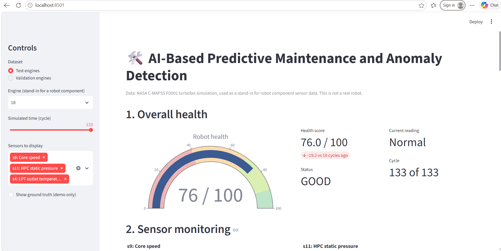

# AI-Based Predictive Maintenance and Anomaly Detection

An end-to-end **AI/ML project** that analyzes machine sensor data to detect abnormal behavior and identify possible failures early.

The system detects anomalies, generates a **0–100 machine health score**, creates **Warning/Critical alerts**, and displays everything through an interactive **Streamlit dashboard**.

> **Dataset:** NASA C-MAPSS FD001 turbofan engine simulation.
> This dataset is used as a stand-in for machine/robot sensor data. No real robot was used.

---

## 🚀 Project Overview

The main goal of this project is to identify unusual machine behavior **before failure occurs**.

### Workflow

```text
Sensor Data
     ↓
Data Preprocessing
     ↓
Feature Engineering
     ↓
Anomaly Detection
     ↓
Health Score
     ↓
Warning / Critical Alerts
     ↓
Streamlit Dashboard
```

---

## 🤖 Machine Learning Models

Three anomaly detection approaches were implemented and compared:

### 1. Z-Score

A statistical baseline that identifies sensor values that are significantly different from normal behavior.

### 2. Isolation Forest ⭐

The **main machine learning model** of the project.

It is trained using healthy machine data and identifies unusual patterns without requiring failure labels during training.

### 3. Autoencoder

A **PyTorch neural network** that learns to reconstruct normal sensor data.

A high reconstruction error indicates abnormal behavior.

---

## 📊 Results

The models were evaluated on unseen test engines.

| Model                | Precision |    Recall |        F1 |   ROC-AUC | Engines Detected |
| -------------------- | --------: | --------: | --------: | --------: | ---------------: |
| Z-Score              |     0.422 |     0.883 |     0.571 |     0.986 |            22/25 |
| **Isolation Forest** | **0.363** | **0.946** | **0.525** | **0.988** |        **24/25** |
| Autoencoder          |     0.306 |     0.687 |     0.424 |     0.935 |            18/25 |

### Key Result

**Isolation Forest detected 24 out of 25 test engines** and achieved the highest ROC-AUC of **0.988**.

The anomaly threshold is calculated using healthy validation data, so the main model does not require failure labels for training.

---

## ❤️ Machine Health Score

The system converts the anomaly score into a **0–100 health score**.

| Health Score | Status      |
| -----------: | ----------- |
|       90–100 | 🟢 Healthy  |
|        70–89 | 🟢 Good     |
|        40–69 | 🟡 Warning  |
|     Below 40 | 🔴 Critical |

The health score is a **severity indicator**, not a probability of failure or an RUL prediction.

---

## 🚨 Alert System

The system generates alerts when abnormal behavior continues for multiple cycles.

* **Warning** – early indication of degradation
* **Critical** – serious degradation close to failure
* Alerts require **3 consecutive flagged cycles**
* Alerts include engine number, cycle, severity, health score and anomaly information

The dataset does not contain real timestamps, so the project uses a **simulated time** where one cycle represents one hour.

---

## 📁 Dataset

This project uses the **NASA C-MAPSS FD001** dataset.

It contains simulated turbofan engine sensor data from healthy operation until failure.

* 100 training engines
* 100 test engines
* 21 sensor channels
* 3 operating settings
* Multiple operating cycles

Some sensors are constant or provide very little useful information, so only the informative sensors are used for modeling.

---

## ⚙️ Data Processing

The project performs:

* Data cleaning
* Missing-value handling
* Sensor selection
* Standard scaling
* Engine-based train/validation split
* Time-series feature engineering

Features include:

* Raw sensor values
* Rolling mean
* Rolling standard deviation
* Rate of change
* RMS
* Peak
* Kurtosis
* Skewness

The feature calculations use only **past sensor readings**, so future information is not used.

---

## 📈 Streamlit Dashboard

The project includes an interactive dashboard for monitoring machine health.

### Dashboard includes:

* Overall machine health
* Health score
* Current machine status
* Sensor monitoring
* Anomaly score
* Alert notifications
* Health trend
* Model information
* Simulated-time replay

Run the dashboard using:

```bash
streamlit run dashboard/app.py
```

### Dashboard Preview



---

## 🛠️ Technologies Used

* **Python**
* **Pandas**
* **NumPy**
* **Scikit-learn**
* **PyTorch**
* **Matplotlib**
* **Streamlit**
* **SQLite**

---

## 📂 Project Structure

```text
predictive-maintenance-anomaly-detection/
│
├── data/
│   ├── raw/
│   └── processed/
│
├── src/
│   ├── data_loading.py
│   ├── data_preprocessing.py
│   ├── feature_engineering.py
│   ├── baseline.py
│   ├── anomaly_detection.py
│   ├── model_evaluation.py
│   ├── health_score.py
│   ├── alert_engine.py
│   └── autoencoder.py
│
├── dashboard/
│   └── app.py
│
├── models/
├── results/
├── main.py
├── requirements.txt
└── README.md
```

---

## 🚀 How to Run

### 1. Clone the repository

```bash
git clone https://github.com/Akankshaghule/predictive-maintenance-anomaly-detection.git
cd predictive-maintenance-anomaly-detection
```

### 2. Create a virtual environment

```bash
python -m venv venv
```

### 3. Activate it

**Windows:**

```bash
venv\Scripts\activate
```

### 4. Install dependencies

```bash
pip install -r requirements.txt
```

### 5. Add the dataset

Download the NASA C-MAPSS **FD001** dataset and place:

```text
train_FD001.txt
test_FD001.txt
RUL_FD001.txt
```

inside:

```text
data/raw/
```

### 6. Run the complete pipeline

```bash
python main.py
```

### 7. Run the dashboard

```bash
streamlit run dashboard/app.py
```

---

## 🎯 What I Learned

This project helped me learn:

* Machine learning with sensor data
* Anomaly detection
* Unsupervised learning
* Feature engineering
* Time-series data processing
* PyTorch Autoencoders
* Model evaluation
* Health-score development
* Alert systems
* Streamlit dashboard development
* End-to-end ML project development

---

## ⚠️ Limitations

* Uses simulated NASA turbofan data rather than real robot data
* FD001 contains only one operating condition and fault mode
* The dataset is relatively small
* Results may not directly transfer to real machines
* The health score is not an actual failure probability
* The project does not currently perform RUL prediction

---

## 🔮 Future Improvements

* Test on NASA C-MAPSS FD002–FD004
* Add real vibration datasets
* Add Remaining Useful Life (RUL) prediction
* Add MQTT/real-time sensor streaming
* Add FastAPI inference service
* Add email/Telegram notifications
* Test with real machine or robot sensors

---

## 👩‍💻 Author

**Akanksha Ghule**

BE Computer Engineering

GitHub: [Akanksha Ghule](https://github.com/Akankshaghule)
