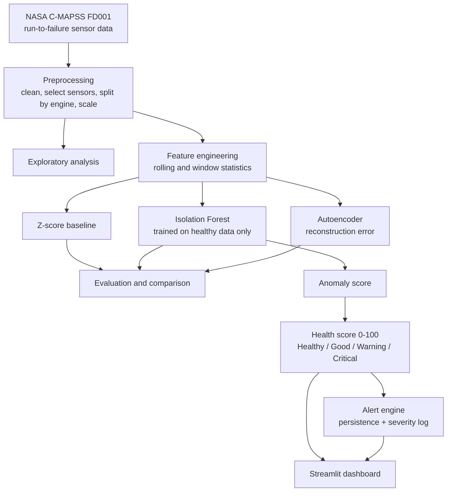

# AI-Based Predictive Maintenance and Anomaly Detection

An end-to-end machine-learning system that learns what **healthy** machine behaviour looks like from sensor data, detects abnormal behaviour before failure, turns it into a 0-100 **health score**, raises **Warning / Critical alerts**, and shows everything in an interactive **Streamlit dashboard**.

> **Scope note.** The data is the NASA C-MAPSS FD001 turbofan engine degradation simulation. It is used here as a stand-in for robot/machine component sensor data (motors, bearings, gears). **No real robot was used, and no claim is made about performance on real robots.**

## Results at a glance

Held-out **test engines** (never used for fitting or tuning). All three methods use the same label-free alarm calibration: the threshold is the 99.5th percentile of each method's scores on healthy validation rows.

| Method | Precision | Recall | F1 | ROC-AUC | False alarms on healthy rows | Engines detected | Median lead time (cycles) |
|---|---|---|---|---|---|---|---|
| Z-score baseline | 0.422 | 0.883 | 0.571 | 0.986 | 0.4% | 22/25 | 34.0 |
| **Isolation Forest** | 0.363 | 0.946 | 0.525 | 0.988 | 0.6% | **24/25** | 38.5 |
| Autoencoder (PyTorch) | 0.306 | 0.687 | 0.424 | 0.935 | 1.2% | 18/25 | 50.5 |

Lead time is measured over the engines each method detected. "Detected" means a persistent alarm (3 consecutive flagged cycles) before failure.

Key takeaways:

- **Isolation Forest is the main model.** It ranks as well as a tuned z-score rule (ROC-AUC 0.988 vs 0.986) and detects the most engines (24/25). Its practical advantage is that its alarm threshold needs only healthy data, no failure labels.
- **A simple baseline is genuinely competitive on this dataset.** Reporting that honestly is part of the point.
- **The label-free threshold transferred.** The target false alarm rate on healthy data was 0.5%. It came out at 0.5% on validation engines and 0.6% on unseen test engines.
- **Engineered window features did not meaningfully improve detection.** Raw sensors were already sufficient.

## Architecture



## Dataset

NASA C-MAPSS subset **FD001**: simulated turbofan engines, each run from healthy operation until failure.

- 100 training engines (20,631 rows), lifetimes of 128 to 362 cycles (mean 206.3)
- 100 test engines (13,096 rows) that stop *before* failure, with the true remaining life at the last cycle provided
- 21 sensor channels, 3 operating settings, one operating condition, one fault mode
- 7 columns are constant and carry no information. `s6` is nearly constant (shift of 0.19 healthy standard deviations before failure) and was dropped, leaving **14 informative sensors**.
- There are no explicit anomaly labels. Labels are derived from the run-to-failure structure and used **only for evaluation**: a row is *healthy* if more than 100 cycles remain, and *anomalous* if 30 or fewer remain.

## Preprocessing

- Duplicates and missing values are handled (none were present in FD001).
- **Outliers are kept.** Extreme values near failure are the signal being detected.
- Split **by engine**, never by row: 80 training engines, 20 validation engines, plus the 100 official test engines. Shuffling rows of a time series would leak information.
- Standard scaling is fitted on **healthy rows of the training engines only**, then applied unchanged to validation and test.
- Test-engine RUL for every row is reconstructed from the official end-of-life RUL file.

## Feature engineering

Per engine, using a **backward-looking** window of 10 cycles (no future information; the first 9 cycles of each engine are dropped as warm-up):

- Trend: rolling mean, rolling standard deviation, rate of change (5-cycle lag)
- Shape: RMS, peak, kurtosis, skewness

That gives 112 features (14 sensors x 8 feature types). FFT features were skipped because C-MAPSS has one reading per cycle, not a vibration waveform.

Measured shift from healthy to near-failure, in healthy standard deviations (average per feature type): `rms` 5.81, `peak` 3.95, `rmean` 3.37, `raw` 2.77, `rate` 0.31, `rstd` 0.29, `skew` 0.05, `kurt` 0.03. Kurtosis and skewness carry almost no signal here. However, this score did **not** translate into better detection (see below).

## Models

### Z-score baseline
Flag a cycle when at least `k` of the 14 sensors are more than `z` standard deviations from healthy behaviour. Using the supervised grid on validation, the best setting was `k=3, z=3.0` (validation F1 0.847). On test it was too strict (F1 0.634, recall 0.542, only 15/25 engines detected). A naive "any one sensor beyond 3 sigma" rule gave test precision of only 0.296.

### Isolation Forest (main model)
300 trees, trained on healthy rows only (7,590 rows from 80 engines). Six feature sets were compared on validation; all landed within a narrow band (validation F1 0.709 to 0.724, AUC 0.975 to 0.982), so no feature set is claimed to be better. The `raw+trend` set (56 features) was selected. The alarm threshold is the 99.5th percentile of healthy validation scores, so it needs no failure labels.

### Autoencoder (PyTorch, comparison)
Healthy-only training, early stopping on healthy validation rows, reconstruction error as the anomaly score.

- **First attempt (same 56 features as Isolation Forest):** validation AUC 0.734, test AUC 0.643, 3/25 test engines detected. Diagnosis: half of those features are near-pure noise, which cannot be compressed, so the healthy reconstruction error floor (about 0.5) swamped the real signal.
- **Second attempt (6 candidates, selected on validation only):** feature sets `raw`, `rmean`, `rms+peak` with bottleneck sizes 3 and 6. Best was `rms+peak` with bottleneck 3 (validation AUC 0.942). The `raw` and `rmean` sets scored only 0.69 to 0.77.
- Result: a large improvement, but still behind Isolation Forest and the baseline on test (see the table above). One training seed was used.

## Evaluation protocol

- Metrics: precision, recall, F1, ROC-AUC, false alarm rates, **detection lead time**. Accuracy is not used because the data is heavily imbalanced.
- Two false alarm rates are reported: over all normal-labelled rows, and over *healthy* rows only (more than 100 cycles from failure). Rows 31 to 100 cycles before failure count as "normal" in the row-level labels even though degradation has started, so early warnings reduce precision. This is why precision looks low while healthy-phase false alarms stay under about 1%.
- Thresholds and model choices were made on validation engines only. The test set was used for reporting.

## Health score

The anomaly score is smoothed (5-cycle causal average) and mapped piecewise-linearly to 0-100 through four anchors fitted on validation engines: healthy median = 100, healthy 99.5th percentile = 70, median of the last 15 cycles before failure = 40, 95th percentile of the last 15 cycles = 0. Bands: **Healthy** 90-100, **Good** 70-89, **Warning** 40-69, **Critical** below 40. All anchors and bands are configurable in `src/config.py`.

Mean health by distance to failure (test engines): more than 100 cycles out 96.5, 76-100 94.4, 51-75 87.3, 31-50 71.9, 16-30 52.5, 0-15 39.2. On validation engines the same zones give 96.5, 90.7, 80.4, 64.5, 48.8, 31.2.

The score is a **severity index**, not a probability of failure and not an RUL estimate.

## Alert system

Severity comes from the health band (Warning or Critical). An alert is logged only after 3 consecutive cycles at that severity, once per escalation, and the state resets when the condition clears. Each alert records simulated time, engine, cycle, severity, the most deviating sensor (indicative, not a diagnosis), anomaly score, health and a message. The time axis is a **simulated clock** (1 cycle = 1 hour) because the dataset has no real timestamps.

| | Validation (20 engines) | Test (25 engines reaching the failure zone) |
|---|---|---|
| Warning before failure | 20/20, median lead 48 cycles | 24/25, median lead 40 cycles |
| Critical before failure | 12/20, median lead 12 cycles | 5/25, median lead 15 cycles |
| Alerts raised while still healthy | 1 (1 of 20 engines) | 4 (3 of 100 engines) |

Warning is the early-warning level. Critical fires only close to failure.

## Dashboard

```bash
streamlit run dashboard/app.py
```

Sections: overall health gauge and status, sensor monitoring with flagged cycles, anomaly score against the alarm threshold, live alert banner plus alert log, health trend over time, and model information with real evaluation metrics. A "simulated time" slider replays an engine's history to demonstrate live monitoring. An optional demo-only checkbox shows the ground-truth failure zone.

<!-- Add your screenshot: save it as docs/dashboard_overview.png -->


Selected figures: `results/figures/06_alarm_rate_by_zone.png`, `07_lead_time.png`, `09_health_trajectories.png`, `11_model_comparison.png`.

## Limitations

- **Not a robot.** Data is a turbofan simulation with a single operating condition and a single fault mode (FD001). Results do not transfer automatically to real robots or to harder subsets.
- **Small evaluation sets.** 20 validation engines and 25 test engines that reach the failure zone. Differences of a few points in F1 or AUC are within noise, and no confidence intervals or multiple seeds were run.
- **Test engines are truncated.** Some end before degradation is visible (for example engine 18 ends 28 cycles before failure with only 3 anomaly rows), so "detected" counts include engines that never had a fair chance.
- **The label is a choice.** "Anomaly means 30 cycles or fewer before failure" is arbitrary, and it penalises early warnings.
- **The health scale was calibrated on 20 engines.** Test engines look slightly healthier than validation engines at the same distance to failure, so health is not an exact countdown.
- **Per-engine rank correlation between health and RUL is weaker on test** (mean 0.55, minimum -0.28) than on validation (mean 0.79), partly because it includes each engine's long flat healthy stretch.
- **Sensor attribution is indicative only.** Sensors are strongly correlated, and the "most deviating sensor" changes between engines.
- **Critical alerts are late and incomplete** by design (anchored to the last 15 cycles).
- The simulated clock in the alert log is for display only.

## Future work

- Run on FD002 to FD004 (multiple operating conditions and fault modes)
- Vibration datasets (IMS, CWRU) with FFT features, closer to bearing and gear faults
- Remaining Useful Life regression with RMSE and MAE, validated separately
- Multiple seeds and confidence intervals
- Rapid-decline alert rule, evaluated for false alarms
- Streaming ingestion (MQTT), a FastAPI inference service, email or Telegram notifications
- A real small-scale test rig (accelerometer and current sensor)

## Run it

Place `train_FD001.txt`, `test_FD001.txt` and `RUL_FD001.txt` from NASA C-MAPSS in `data/raw/`, then:

```bash
python -m venv venv
venv\Scripts\activate            # Windows PowerShell
pip install -r requirements.txt
python main.py                   # runs every stage in order
streamlit run dashboard/app.py
```

Or run stages individually: `python -m src.data_loading`, `src.eda`, `src.data_preprocessing`, `src.feature_engineering`, `src.baseline`, `src.anomaly_detection`, `src.model_evaluation`, `src.health_score`, `src.alert_engine`, `src.autoencoder`.

## Project structure

```text
data/raw, data/processed     input data and generated feature/score files
src/                         config, loading, preprocessing, features, baseline,
                             anomaly detection, evaluation, health score, alerts, autoencoder
dashboard/app.py             Streamlit dashboard
models/                      scaler.pkl, isolation_forest.pkl, autoencoder.pth, health_scale.json
results/figures, metrics     plots and metric files from the actual runs
main.py                      runs the whole pipeline
```

All reported numbers come from actual runs of this code. Nothing is hard-coded or copied from examples.
